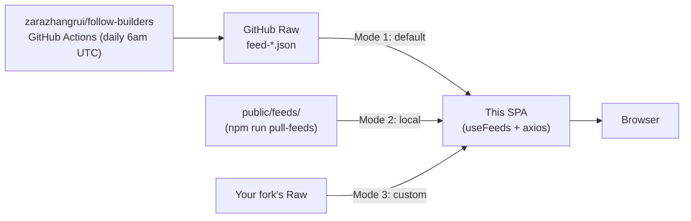

# Follow Builders Web

> A clean, tech-styled web frontend for the [`follow-builders`](https://github.com/zarazhangrui/follow-builders) AI-agent skill — read what 25 hand-picked AI builders ship today, in one place.

<p>
  <a href="./README.md"><b>English</b></a> ·
  <a href="./README.zh-CN.md">简体中文</a>
</p>

<p>
  
  
  
  
  
</p>

## What is this?

[`follow-builders`](https://github.com/zarazhangrui/follow-builders) is a Cursor / Claude agent skill that runs daily on GitHub Actions and produces three JSON feeds:

- `feed-x.json` — recent tweets from 25 AI builders (Karpathy, simonw, swyx, …)
- `feed-podcasts.json` — fresh AI-podcast episodes with auto-generated transcripts
- `feed-blogs.json` — new posts from those builders' personal blogs

The skill is great, but the JSON itself isn't very readable. **This repo is the missing UI** — a static React SPA that renders those feeds with grouped tweets, collapsible transcripts, light/dark theming and a tech-styled visual treatment. Zero backend, deploy anywhere static.

## Screenshots

| Light | Dark |
| --- | --- |
|  |  |

## Features

- 🌗 **Light / dark theme** — follows system, persisted in `localStorage`, smooth transitions
- ✨ **Tech-styled visuals** — subtle grid background, gradient glow orbs, card hover lift
- 🐦 **Tweets grouped by author** with avatar, handle, engagement counts, jump-to-source
- 🎙 **Podcast cards** with one-click transcript expand
- 📝 **Blog cards** with graceful empty state
- ☁️ **3 data-source modes** — remote (default), local cache, your own fork (env var switch)
- 🔄 **Manual refresh** with cache-buster, bypasses CDN cache
- 📱 **Responsive** down to 375px
- 0️⃣ **Zero backend, zero secrets** — pure static SPA, host on Vercel / Netlify / Pages / S3

## Quick start

```bash
git clone <your-fork-url> follow-builders-web
cd follow-builders-web
npm install
npm run dev          # http://localhost:5173
```

By default the dev server pulls the latest data straight from upstream GitHub Raw — no API key, no config, no local clone needed.

```bash
npm run build        # → dist/
npm run preview
```

## Tech stack

- **Vite 6** + **React 18** + **TypeScript 5**
- **Tailwind CSS 3** with CSS-variable-driven palette
- **Radix UI** primitives + hand-rolled shadcn/ui-style `Button` / `Tabs` / `Badge` / `Skeleton`
- **axios** for fetching, **date-fns** for time, **lucide-react** for icons

## Architecture



```
.
├── public/feeds/             # JSON synced by copy-feeds / pull-feeds (gitignored)
├── scripts/copy-feeds.mjs    # Copy a sibling clone's feed-*.json into public/feeds/
├── scripts/pull-feeds.mjs    # Download latest feeds from upstream GitHub Raw
└── src/
    ├── components/           # Header / FeedTabs / TweetCard / PodcastCard / BlogCard …
    ├── components/ui/        # shadcn/ui-style Button / Tabs / Badge / Skeleton
    ├── hooks/useFeeds.ts     # axios — fetch all three feeds in parallel
    ├── lib/                  # types / utils / format / api
    └── providers/            # ThemeProvider (class-based dark + localStorage)
```

## Data source — three modes

Switched via the `VITE_FEED_BASE` env var. Copy [.env.example](.env.example) to `.env.local` and tweak as needed.

### Mode 1 · Remote (default ✅)

Fetches directly from upstream [zarazhangrui/follow-builders](https://github.com/zarazhangrui/follow-builders) GitHub Raw, auto-updated daily at 6am UTC by their GitHub Actions. **Zero config, always fresh.**

```bash
npm run dev
```

### Mode 2 · Local cache

Pull the JSON into `public/feeds/` and serve it from your own static files — best for offline dev, stable demos, or baking the data into the `dist/` build.

```bash
npm run pull-feeds                          # pull latest from GitHub Raw (recommended)
# or: npm run copy-feeds                    # copy from a sibling clone of follow-builders

echo "VITE_FEED_BASE=/feeds" > .env.local
npm run dev
```

`npm run dev:local` runs copy + dev in one shot.

### Mode 3 · Custom (your own fork)

If you've forked follow-builders with your own X / pod2txt API keys, point `VITE_FEED_BASE` at your fork's raw URL:

```bash
echo "VITE_FEED_BASE=https://raw.githubusercontent.com/<you>/follow-builders/main" > .env.local
```

> ⚠️ Running your own pipeline needs the paid X v2 API (~$200/mo) plus a pod2txt key. Mode 1 covers most use cases.

The header always shows which source is active:

- ☁️ **GitHub Raw · auto-updated daily** — Mode 1
- 💾 **Local cache (public/feeds)** — Mode 2
- ☁️ **Custom source** — Mode 3

Click the refresh button (top right) to refetch with a cache-buster that bypasses CDN caches.

## Theming

- Defaults to the system's `prefers-color-scheme`, user choice persists in `localStorage`.
- Light/dark palettes live as CSS variables in [src/index.css](src/index.css) — drop in your own brand colors easily.
- Background uses a fine grid + two gradient glow orbs for the techy feel.

## Limitations & known issues

Honest list, in order of how much they bite:

- **🔒 Locked to upstream's 25 builders.** Adding a new X handle requires forking [`follow-builders`](https://github.com/zarazhangrui/follow-builders), paying for the X v2 API (Basic ≈ $200/mo as of 2026), and pointing `VITE_FEED_BASE` at your fork. The frontend can only filter/sort what's already in the JSON. See [discussion in Roadmap](#roadmap) for free alternatives (Bluesky / Mastodon / RSS).
- **⏰ Data freshness depends on upstream Actions.** If upstream's GitHub Action breaks or the maintainer pauses it, the page shows stale data — there's no health-check or "last updated > 48h" warning yet.
- **🌐 Single point of failure.** Mode 1 depends on `raw.githubusercontent.com`. If GitHub Raw is down or rate-limits your IP, the page fails to load. There's no retry / fallback chain.
- **🔍 No search / filter / favorites.** Can't subscribe to a subset of builders, can't search across tweets, can't bookmark.
- **🌍 Original-language only.** Tweets and posts are shown in their original language — no translation pipeline (the upstream skill has a translation prompt but this UI doesn't surface it).
- **📭 Blog feed often empty.** Upstream's blog crawler is conservative; the empty state is hit more often than not.
- **🔁 Manual refresh only.** No auto-polling, no `visibilitychange` re-fetch, no "X hours until next update" indicator.
- **♿ A11y not audited.** Keyboard nav and screen-reader labels are basic but not formally tested.
- **🧪 No tests.** No unit, integration, or e2e coverage.
- **📲 No PWA / offline.** Works fine offline if you've baked feeds in via Mode 2, but no service worker or install prompt.

## Roadmap

Loose list of things I'd add next, roughly in priority order:

- [ ] Stale-data warning in the header when `generatedAt > 48h ago`
- [ ] Subscribe / favorite UI (per-builder toggle, persisted in `localStorage`)
- [ ] Tweet & blog full-text search (client-side, MiniSearch)
- [ ] Sort modes: by time / by engagement / by author
- [ ] Auto-refresh on tab focus (`visibilitychange`) + hourly poll
- [ ] Bluesky / Mastodon / RSS adapters (free alternatives to X)
- [ ] Optional translation pass (run upstream's `translate.md` prompt at build time)
- [ ] Dockerfile + one-click Vercel / Netlify deploy buttons
- [ ] Vitest unit tests for hooks & formatters

PRs welcome on any of these. 🙌

## Deployment

This is a fully static site — drop `dist/` on any static host:

```bash
npm run build
# → dist/  (deploy this folder)
```

Tested on Vercel, Netlify, Cloudflare Pages, GitHub Pages. No env vars needed for the default remote mode.

## Contributing

1. Fork & branch off `main`
2. `npm install && npm run dev`
3. Keep PRs focused; match existing code style (`npm run lint`)
4. Update the [Roadmap](#roadmap) checkbox if you ship one of those items

## Acknowledgements

- [@zarazhangrui](https://github.com/zarazhangrui) for the original [`follow-builders`](https://github.com/zarazhangrui/follow-builders) skill that produces all the data
- [shadcn/ui](https://ui.shadcn.com/) for the component patterns this UI borrows from
- The 25 builders themselves — go follow them on X 🚀

## License

MIT — see [LICENSE](./LICENSE).
