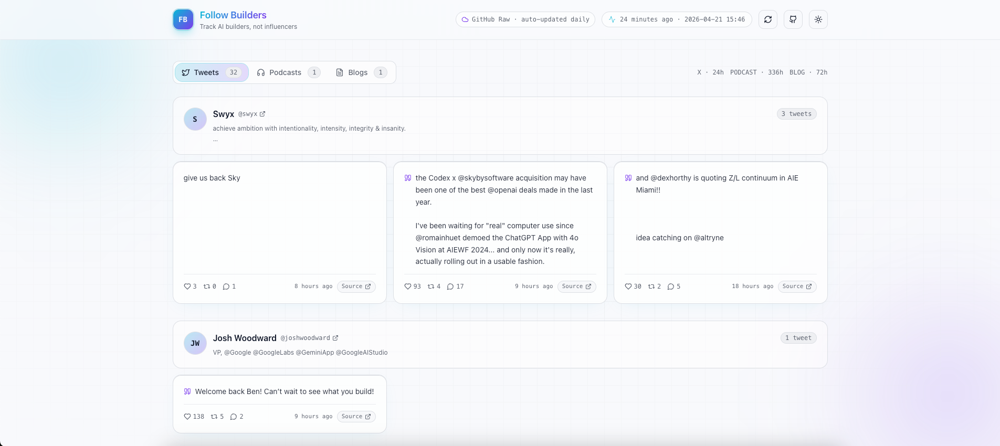
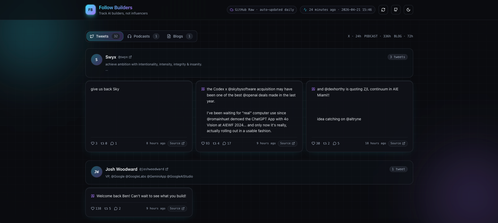
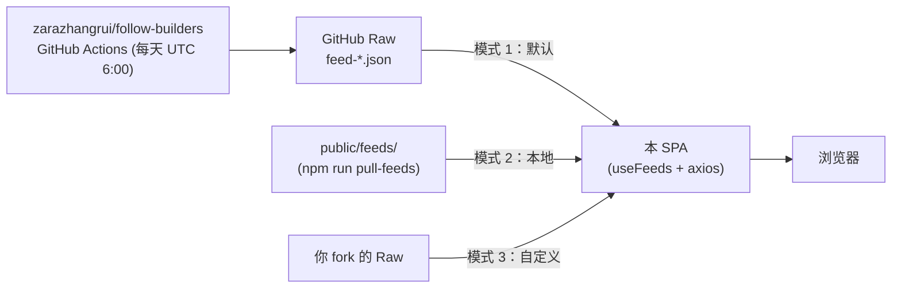

# Follow Builders Web

> [`follow-builders`](https://github.com/zarazhangrui/follow-builders) AI Agent Skill 的科技风 Web 前端 —— 在一个页面里看 25 位精选 AI builder 今天写了啥、播了啥、发了啥。

<p>
  <a href="./README.md">English</a> ·
  <a href="./README.zh-CN.md"><b>简体中文</b></a>
</p>

<p>
  
  
  
  
  
</p>

## 这是什么

[`follow-builders`](https://github.com/zarazhangrui/follow-builders) 是一个跑在 GitHub Actions 上、每天产出三个 JSON 的 Cursor / Claude Agent Skill：

- `feed-x.json` —— 25 位 AI builder（Karpathy、simonw、swyx……）的最新推文
- `feed-podcasts.json` —— 新鲜 AI 播客 + 自动转写文本
- `feed-blogs.json` —— 这些 builder 个人博客的新文

Skill 本身很好，但 JSON 直接看实在不舒服。**这个仓库就是它缺失的那块 UI** —— 一个纯静态 React SPA，把 feed 渲染成按作者分组的推文、可折叠的播客转写、明暗双主题的科技风界面。零后端，随便部哪儿。

## 截图

| 浅色 | 深色 |
| --- | --- |
|  |  |

## 功能

- 🌗 **明暗主题** —— 跟随系统、`localStorage` 记忆、平滑切换
- ✨ **科技风视觉** —— 细网格背景、双渐变光晕、卡片悬浮抬升
- 🐦 **推文按作者分组**，含头像、handle、互动数、跳转原推
- 🎙 **播客卡片**，转写一键展开
- 📝 **博客卡片**，空数据有专门的空态
- ☁️ **3 种数据源** —— 远程（默认）/ 本地缓存 / 你自己的 fork（环境变量切换）
- 🔄 **手动刷新** + 缓存破坏参数，绕过 CDN 缓存
- 📱 **响应式**，375px 也舒服
- 0️⃣ **零后端零密钥** —— 纯静态 SPA，Vercel / Netlify / Pages / S3 都能托

## 快速开始

```bash
git clone <你的 fork 地址> follow-builders-web
cd follow-builders-web
npm install
npm run dev          # http://localhost:5173
```

默认情况下 dev server 直接从上游 GitHub Raw 拉最新数据 —— 不需要 API key、不需要配置、不需要本地克隆 follow-builders。

```bash
npm run build        # → dist/
npm run preview
```

## 技术栈

- **Vite 6** + **React 18** + **TypeScript 5**
- **Tailwind CSS 3**，调色板用 CSS 变量驱动
- **Radix UI** primitives + 手写的 shadcn/ui 风格 `Button` / `Tabs` / `Badge` / `Skeleton`
- **axios** 取数、**date-fns** 时间、**lucide-react** 图标

## 架构



```
.
├── public/feeds/             # JSON 文件，由 copy-feeds / pull-feeds 同步（已 gitignore）
├── scripts/copy-feeds.mjs    # 从同级目录的 follow-builders 克隆复制 feed-*.json
├── scripts/pull-feeds.mjs    # 从上游 GitHub Raw 拉最新 feed
└── src/
    ├── components/           # Header / FeedTabs / TweetCard / PodcastCard / BlogCard …
    ├── components/ui/        # shadcn/ui 风格的 Button / Tabs / Badge / Skeleton
    ├── hooks/useFeeds.ts     # axios —— 并行拉取三个 feed
    ├── lib/                  # types / utils / format / api
    └── providers/            # ThemeProvider（class 模式 dark + localStorage）
```

## 数据源 —— 三种模式

通过 `VITE_FEED_BASE` 环境变量切换。复制 [.env.example](.env.example) 为 `.env.local` 后按需修改。

### 模式 1 · 远程（默认 ✅）

直接从上游 [zarazhangrui/follow-builders](https://github.com/zarazhangrui/follow-builders) 的 GitHub Raw 拉，由原作者的 GitHub Actions 每天 UTC 6:00 自动更新。**零配置，永远是最新的。**

```bash
npm run dev
```

### 模式 2 · 本地缓存

把 JSON 拉到 `public/feeds/`，从自己的静态文件提供 —— 适合离线开发、稳定的演示、或者把数据烤进 `dist/` 构建里。

```bash
npm run pull-feeds                          # 从 GitHub Raw 拉（推荐）
# 或：npm run copy-feeds                    # 从同级目录的 follow-builders 克隆复制

echo "VITE_FEED_BASE=/feeds" > .env.local
npm run dev
```

`npm run dev:local` 一条命令搞定 copy + dev。

### 模式 3 · 自定义（你自己的 fork）

如果你 fork 了 follow-builders 并配了自己的 X / pod2txt API key，把 `VITE_FEED_BASE` 指向你 fork 的 raw URL：

```bash
echo "VITE_FEED_BASE=https://raw.githubusercontent.com/<你>/follow-builders/main" > .env.local
```

> ⚠️ 自己跑 pipeline 需要付费 X v2 API（2026 年 Basic 档约 $200/月）外加一个 pod2txt key。模式 1 已经能覆盖绝大多数场景。

页面 Header 始终显示当前数据源：

- ☁️ **GitHub Raw · auto-updated daily** —— 模式 1
- 💾 **Local cache (public/feeds)** —— 模式 2
- ☁️ **Custom source** —— 模式 3

点右上角的刷新按钮可以带缓存破坏参数手动重拉，绕过 CDN 缓存。

## 主题定制

- 默认跟随系统 `prefers-color-scheme`，用户选择持久化到 `localStorage`。
- 明暗调色板都是 [src/index.css](src/index.css) 里的 CSS 变量 —— 直接换成你的品牌色就行。
- 背景由细网格 + 两个渐变光晕组成科技感。

## 已知不足 / 限制

诚实清单，按"对你影响多大"排序：

- **🔒 锁死在上游的 25 位 builder。** 想加新的 X handle 必须 fork [`follow-builders`](https://github.com/zarazhangrui/follow-builders)、付费 X v2 API（2026 Basic 档 ≈ $200/月）、再把 `VITE_FEED_BASE` 指向你的 fork。前端只能在已有 JSON 范围内筛选/排序。免费替代方案见 [Roadmap](#roadmap)（Bluesky / Mastodon / RSS）。
- **⏰ 数据新鲜度依赖上游 Actions。** 如果上游的 Action 挂了或维护者暂停了，页面就会一直显示旧数据 —— 当前还没有"上次更新 > 48h"的健康检查或警告。
- **🌐 单点依赖。** 模式 1 依赖 `raw.githubusercontent.com`。GitHub Raw 挂掉或对你 IP 限流，页面就加载不出来，没有重试或回退链路。
- **🔍 没有搜索 / 筛选 / 收藏。** 没法订阅一部分 builder、没法跨推文搜索、没法收藏单条。
- **🌍 仅原文。** 推文和博客都是原语言，没有翻译流水线（上游 Skill 有翻译 prompt，但这个 UI 没接进来）。
- **📭 博客 feed 经常是空的。** 上游博客抓取偏保守，空态触发率挺高。
- **🔁 仅手动刷新。** 没有自动轮询、没有 `visibilitychange` 重拉、没有"距下次更新还有 X 小时"的提示。
- **♿ 无障碍未审计。** 键盘导航和 ARIA 标签写了基础的，但没系统测过。
- **🧪 没有测试。** 单测、集成、e2e 一概没有。
- **📲 不是 PWA、不支持离线。** 用模式 2 烤进去了倒是能离线看，但没有 Service Worker 也没有安装提示。

## Roadmap

按粗略优先级排：

- [ ] `generatedAt > 48h` 时在 Header 显示数据陈旧警告
- [ ] 订阅 / 收藏 UI（按 builder 开关，存 `localStorage`）
- [ ] 推文和博客的全文搜索（前端 MiniSearch）
- [ ] 排序模式：按时间 / 按互动 / 按作者
- [ ] Tab 重新激活时自动刷新（`visibilitychange`）+ 每小时轮询
- [ ] Bluesky / Mastodon / RSS 适配器（X 的免费替代）
- [ ] 可选的翻译流程（构建时跑上游的 `translate.md`）
- [ ] Dockerfile + Vercel / Netlify 一键部署按钮
- [ ] Vitest 单测覆盖 hooks 和 formatters

以上任何一条欢迎 PR。🙌

## 部署

这是个完全静态的站点，把 `dist/` 丢到任何静态托管都能跑：

```bash
npm run build
# → dist/  （部署这个目录）
```

在 Vercel、Netlify、Cloudflare Pages、GitHub Pages 上都验证过。默认远程模式不需要任何环境变量。

## 贡献

1. Fork 后从 `main` 拉分支
2. `npm install && npm run dev`
3. PR 保持小而聚焦，遵循现有代码风格（`npm run lint`）
4. 如果你做掉了 [Roadmap](#roadmap) 里的某项，记得勾上 ✅

## 致谢

- [@zarazhangrui](https://github.com/zarazhangrui) —— 原作 [`follow-builders`](https://github.com/zarazhangrui/follow-builders) Skill 提供了全部数据
- [shadcn/ui](https://ui.shadcn.com/) —— 这套 UI 借鉴了它的组件模式
- 那 25 位 builder 本人 —— 去 X 上关注他们 🚀

## License

MIT —— 见 [LICENSE](./LICENSE)。
